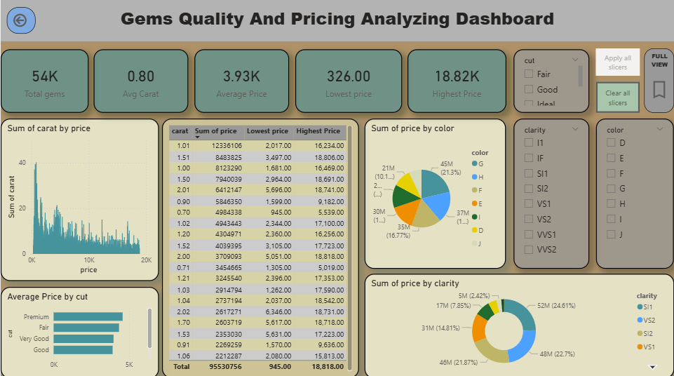

# 💎 Gems Diamond Quality & Pricing Analysis Dashboard

An interactive **Power BI Dashboard** designed to analyze diamond quality, characteristics, and pricing. This project transforms raw diamond data into meaningful visual insights using Power BI, DAX, Power Query, and Excel.

---

# 📊 Dashboard Preview



---

# 📝 Project Overview

The **Gems Diamond Quality & Pricing Analysis Dashboard** provides an interactive analysis of diamond data to understand pricing patterns and the relationship between diamond characteristics and quality.

The project includes data cleaning and transformation, calculated measures and columns, data analysis, and interactive dashboard development.

---

# 🎯 Project Objectives

The main objectives of this project are:

- Analyze diamond quality and pricing data
- Understand the relationship between diamond characteristics and price
- Identify pricing patterns across different diamond attributes
- Create meaningful KPIs and calculated measures
- Clean and transform raw data for analysis
- Build an interactive Power BI dashboard
- Present data-driven insights through visualizations

---

# 🛠️ Tools & Technologies Used

- **Power BI**
- **Power Query**
- **DAX**
- **Microsoft Excel**
- **Data Cleaning & Transformation**
- **Data Modeling**
- **Data Visualization**
- **Business Intelligence**

---

# 📈 Dashboard Features

## 🔹 KPI Analysis

The dashboard includes KPI cards to provide a quick overview of important business metrics.

## 🔹 Diamond Quality Analysis

Analysis of diamond quality and characteristics to understand their impact on pricing.

## 🔹 Pricing Analysis

Visual analysis of diamond prices across different characteristics and quality levels.

## 🔹 Interactive Filters

Interactive slicers and filters allow users to explore the data dynamically.

## 🔹 Data Visualization

The dashboard uses different charts and visualizations to make complex data easier to understand.

---

# 🔄 Data Analysis Process

### 1. Data Collection

The diamond dataset was provided in **Microsoft Excel** format.

### 2. Data Cleaning

Raw data was cleaned and prepared using **Power Query**.

### 3. Data Transformation

Data transformations were performed to make the dataset suitable for analysis.

### 4. Data Modeling

The prepared data was organized and modeled in **Power BI**.

### 5. DAX Calculations

Calculated columns and measures were created using **DAX** to support dashboard analysis.

### 6. Dashboard Development

Interactive KPIs, charts, slicers, and visualizations were created in Power BI.

---

# 📊 Key Skills Demonstrated

- Data Cleaning
- Data Transformation
- Data Analysis
- Power Query
- DAX
- Data Modeling
- KPI Creation
- Data Visualization
- Dashboard Development
- Business Intelligence

---

# 📁 Project Files

| File | Description |
|------|-------------|
| `diamonds.xlsx` | Dataset used for the project |
| `Gems_Diamond_Project.pbix` | Power BI dashboard/project file |
| `Measures_and_Calculated_Columns.xlsx` | DAX measures and calculated columns |
| `Gems_Diamond_Project.pdf` | PDF version of the dashboard |
| `dashboard.png` | Dashboard preview |

---

# 📂 Repository Structure

```text
Gems-Diamond-Analysis/
│
├── README.md
│
├── dataset/
│   └── diamonds.xlsx
│
├── powerbi/
│   ├── Gems_Diamond_Project.pbix
│   └── Measures_and_Calculated_Columns.xlsx
│
├── report/
│   └── Gems_Diamond_Project.pdf
│
└── screenshots/
    └── dashboard.png
